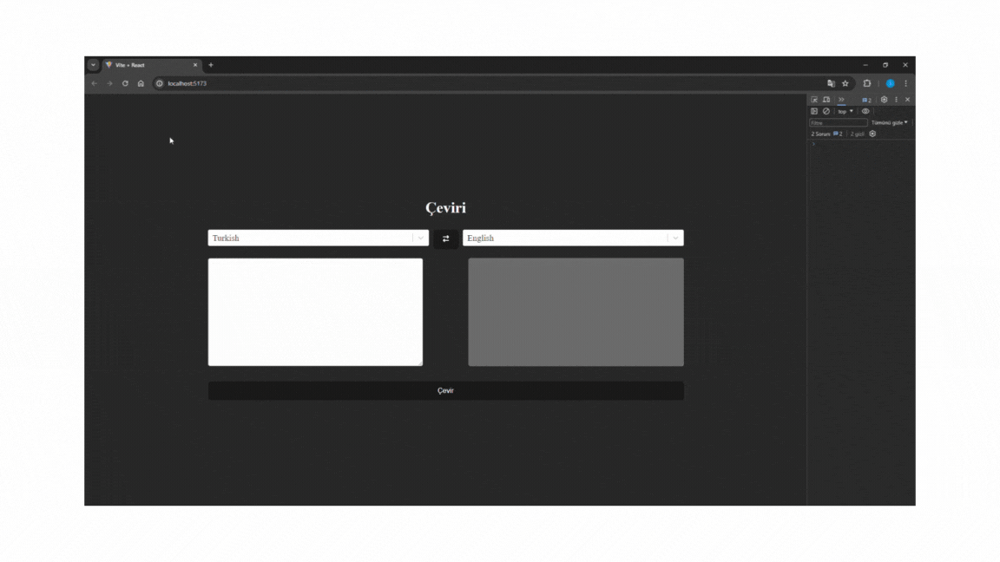

# Toolkit Thunk Çeviri Projesi

- iki dil arasında çeviri yapan bir proje tasarladım.

- diller arasında değiş butonu ile değişim yapılabilir.

- 111 dil seçeneği ile istediğiniz cümleyi çevirebilirsiniz. 

# State yönetiminde; Toolkit

# Api istekleri(RapidApi); Axios

# Stillendirmede; SCSS

# kütüphaneler; react-select , react-icons

